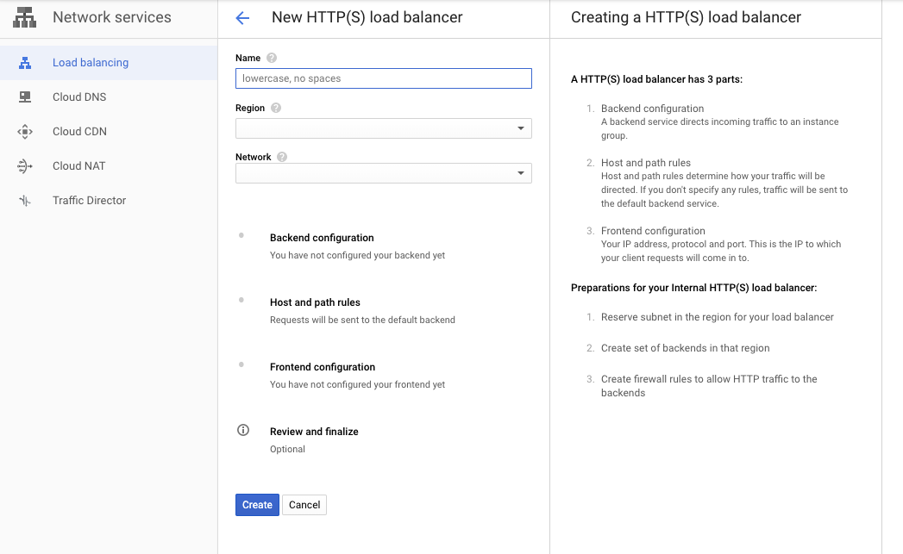

# 技術書展7 Pcisio バックエンド編 サンプル

はじめまして。本リポジトリをご覧いただきありがとうございます。

このリポジトリはバックエンド編でのサンプルコードとなっています。Stripeに限らず、決済代行会社のSDKは似たようなAPIになっているため、本実装が参考になると思います。

ロードバランサの章は、ほとんどがGCP上のUIで完結することが多いため、本リポジトリで紹介をしています。更新があれば、図も合わせて更新する意気込みです。

## 目次

以下の目次で`README.md`は構成されています。

- [目次](#%E7%9B%AE%E6%AC%A1)
- [ディレクトリの構成](#%E3%83%87%E3%82%A3%E3%83%AC%E3%82%AF%E3%83%88%E3%83%AA%E3%81%AE%E6%A7%8B%E6%88%90)
  * [`cmd/`: 機能ごとの実行スクリプト](#cmd-%E6%A9%9F%E8%83%BD%E3%81%94%E3%81%A8%E3%81%AE%E5%AE%9F%E8%A1%8C%E3%82%B9%E3%82%AF%E3%83%AA%E3%83%97%E3%83%88)
  * [`server/`: 簡単な決済サーバー](#server-%E7%B0%A1%E5%8D%98%E3%81%AA%E6%B1%BA%E6%B8%88%E3%82%B5%E3%83%BC%E3%83%90%E3%83%BC)
    + [1. ローカルサーバーを立てる](#1-%E3%83%AD%E3%83%BC%E3%82%AB%E3%83%AB%E3%82%B5%E3%83%BC%E3%83%90%E3%83%BC%E3%82%92%E7%AB%8B%E3%81%A6%E3%82%8B)
      - [起動方法](#%E8%B5%B7%E5%8B%95%E6%96%B9%E6%B3%95)
      - [サーバーの死活確認](#%E3%82%B5%E3%83%BC%E3%83%90%E3%83%BC%E3%81%AE%E6%AD%BB%E6%B4%BB%E7%A2%BA%E8%AA%8D)
    + [2. Dockerでローカルサーバーを立てる](#2-docker%E3%81%A7%E3%83%AD%E3%83%BC%E3%82%AB%E3%83%AB%E3%82%B5%E3%83%BC%E3%83%90%E3%83%BC%E3%82%92%E7%AB%8B%E3%81%A6%E3%82%8B)
      - [ビルド](#%E3%83%93%E3%83%AB%E3%83%89)
      - [サーバーの起動方法](#%E3%82%B5%E3%83%BC%E3%83%90%E3%83%BC%E3%81%AE%E8%B5%B7%E5%8B%95%E6%96%B9%E6%B3%95)
- [ご質問やお問い合わせなど](#%E3%81%94%E8%B3%AA%E5%95%8F%E3%82%84%E3%81%8A%E5%95%8F%E3%81%84%E5%90%88%E3%82%8F%E3%81%9B%E3%81%AA%E3%81%A9)
- [Author](#author)
    + [Github: KeisukeYamashita](#github-keisukeyamashita)

## GCEに対するロードバランサの設定方法

### 1. Instance Templateを作成する

まず、Computer Engineタブの"Instance Template"の中から"Create Instance Template"ボタンを押します。Instance Templateとはロードバランサに紐づくサーバーのクラスタの雛形になるものです。

押すと、以下のような画面へ遷移をします。


主な設定項目は以下の通りです。

 * テンプレートの名前
 * マシンタイプ
 * コンテナイメージ

ここでは、作成したGCRのコンテナイメージを使って、作成をします。他の２つの項目は、ご自身で決めてください。


### 2. Instance Groupを作成する

実際のサーバーのクラスタを雛形であるInstance Templateから作成します。


主な設定項目は以下の通りです。

 * インスタンスグループの名前
 * クラスタのロケーション
 * オートスケールするかの可否

これらの項目は必要に応じて設定をしてください。ここまでで、クラスタを作成することはできました。

### 3. ロードバランサを設定する

ロードバランサはGoogle Load Balancerを使って、設定をします。

サイドバーの"Network Services"から"Load Balancing"を選択し、"Create Load Balancer"を選択します。すると、次の画面へ遷移します。


決済サーバーの決済サーバーは、他のサーバーからのアクセスを想定して"Only between my VMs"を選択します。

すると、以下の画面へ遷移し、3つの項目を設定することになります。



 * Backendの設定
 * Host情報の設定
 * Frontendの設定

#### 3.1 Backendの設定

基本的にはBackendの設定は、先程作成したInstance Groupを設定するだけです。以下の画面で設定をしてください。


#### 3.2 Host情報の設定

「どのパスでアクセスしたら許可・拒否するのか、またどのBackendへ転送するのか」を設定することになります。


今回は複数のBackendがあるわけではないので、指定をする必要があります。

#### 3.3 Frontendの設定

Frontendの設定は、「どのようにこのロードバランサがアクセスするか」を設定します。


主要な設定項目はInternal IP(内部IP)を設定するのみです。決済を行うときは、このIPを通してアクセスすることになります。

## ディレクトリの構成

主要なディレクトリと、その実行内容です。

| ディレクトリ | 実行内容 | 何ができるのか|
|:-----------|:--------|:------|
| `cmd/` | 決済サーバーを構成する機能ごとの実行スクリプト |APIの挙動の参考 |
| `server/` | 簡単な決済サーバー | どのようなサーバーになるかの参考 | 

**それ以外のディレクトリ、およびファイルはドキュメントのためにあります。**

### `cmd/`: 機能ごとの実行スクリプト

以下の項目で実行スクリプトディレクトリ`cmd/`は構成されています。

| ディレクトリ | 実行内容 | 
|:-----------|:--------|
| [charge/charge.go](https://github.com/KeisukeYamashita/pcisio-backend-demo/tree/master/cmd/charge) | Charge APIを呼び、請求を行う | 
| [customer/customer.go](https://github.com/KeisukeYamashita/pcisio-backend-demo/tree/master/cmd/customer) | Customer APIを呼び、顧客オブジェクトを作成 |
| [plan/plan.go](https://github.com/KeisukeYamashita/pcisio-backend-demo/tree/master/cmd/plas) | Productオブジェクトに対してPlanオブジェクトを作成 |
| [product/product.go](https://github.com/KeisukeYamashita/pcisio-backend-demo/tree/master/cmd/product) | Productオブジェクトを作成 |
| [refund/refund.go](https://github.com/KeisukeYamashita/pcisio-backend-demo/tree/master/cmd/refund) | Refund APIを呼び、返金を行う |
| [subscription/subscription.go](https://github.com/KeisukeYamashita/pcisio-backend-demo/tree/master/cmd/subscription) | Subscription APIを呼び、定期払いを作成を作成 |

### `server/`: 簡単な決済サーバー

簡単な決済サーバーを実装しているので、参考までにご覧ください。MySQLがたった状態を前提状態にしています。

#### 1. ローカルサーバーを立てる

##### 起動方法

以下のコマンドで起動をすることができます。`xxx_xxx_xxx_xxx_xxx=`はGoogle Cloud KMSでエンコードした秘密鍵に置き換えてください。

```
$ ENCODED_STRIPE_SECRET_KEY=xxx_xxx_xxx_xxx= KEY=key go run server/server.go
```

起動すると以下のように出力を確認することができます。

```
2019/09/16 03:17:47 server started on port 5050
```

##### サーバーの死活確認

以下のアクセスポイントへリクエストを行って、サーバーの死活確認をしてください。

```
curl localhost:5050/healthz
```

HTTP Status Codeが`200`であればサーバーが実行されている状態です。

#### 2. Dockerでローカルサーバーを立てる

Dockerコンテナを使ってサーバーを立てることもできます。

##### ビルド

まず、コンテナイメージをビルドします。

```
$ make docker
```

もしくは、以下のコマンドを実行してビルドをすることもできます。

```
$ docker build . -t payment-server
```

##### サーバーの起動方法

以下のコマンドを実行して、サーバーを起動します。

```
$ docker run -p 5050:5050 payment-server
```

このようにしてサーバーを立ち上げることができました。

## ご質問やお問い合わせなど

以下のIssueを通してお問い合わせお願いいたします。

できる限り、対応させていただきますので気軽によろしくお願いいたします。

## Author

#### Github: KeisukeYamashita


